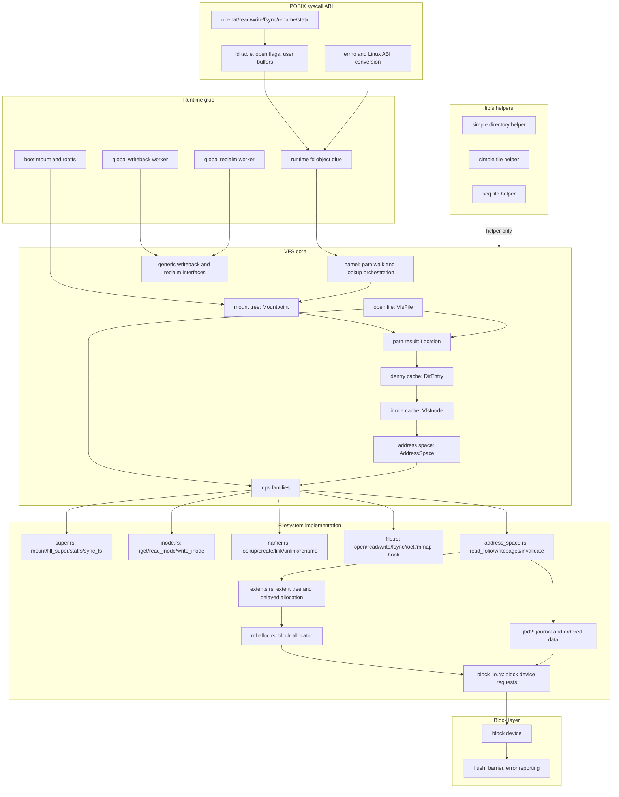
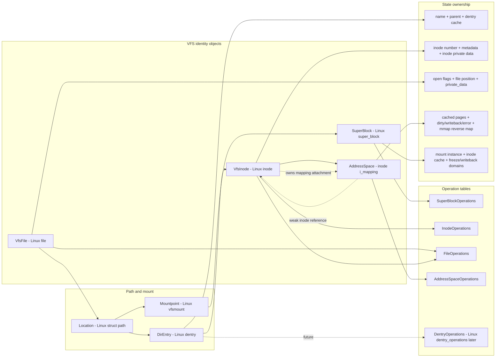
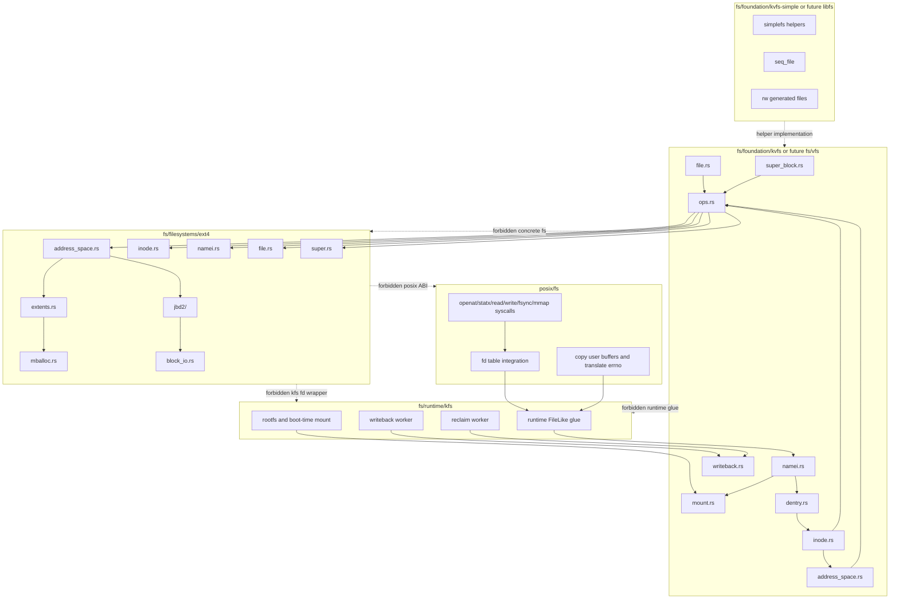
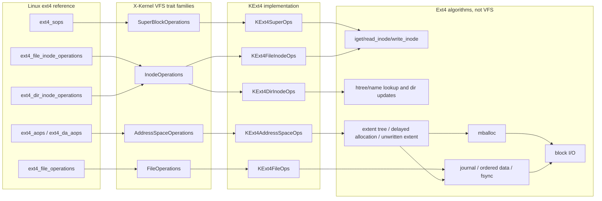
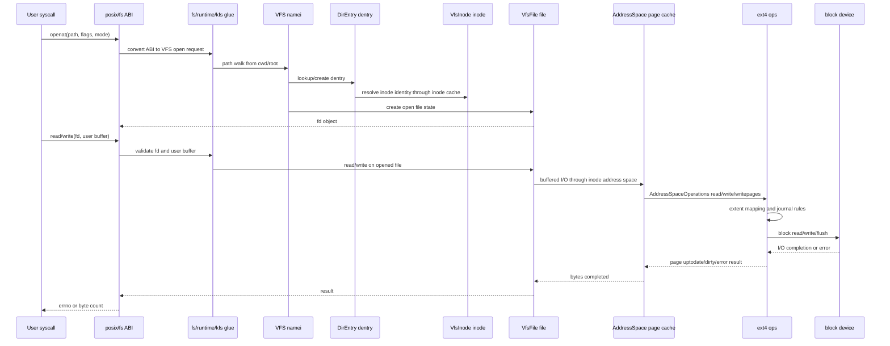
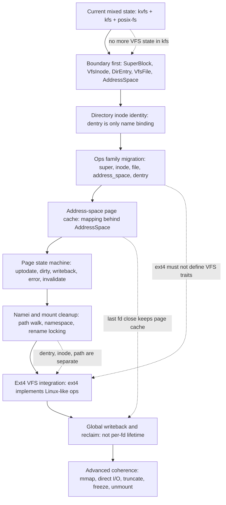

# KExt4 - VFS 与 PageCache 改造规划

## 定位

KExt4 要实现 Linux ext4 风格的 delayed allocation、批量 writeback、
`data=ordered`、可靠 fsync 和高并发 inode 操作，不能只在文件系统内部重写
extent、allocator 和 journal。当前 kvfs/KFS 的对象身份、页缓存接口和回写
模型也需要演进。

本文定义 KExt4 所依赖的 VFS、KFS PageCache、mmap 和存储 I/O 改造。它是目标
架构文档，不表示相关 API 已经存在。

改造必须服务所有磁盘文件系统，不能在 KExt4 中建立一条只有 ext4 能使用的
私有 VFS 旁路。

## 改造前问题

### dentry 与 inode 身份混合

改造前 `DirEntry` 同时保存：

- 路径关系；
- `FileNode` 或 `DirNode`；
- `user_data`；
- node type。

PageCache 通过 `Location::user_data()` 挂在 `DirEntry` 上。硬链接可能产生多个
`DirEntry`，甚至多个文件系统 inode wrapper，因此同一磁盘 inode 可能拥有多份
缓存和锁。第一批 VFS 重构已经把普通文件的缓存迁到 inode attachment，目录 inode
唯一化仍在后续阶段完成。

### PageCache 属于 `CachedFile`

改造前关系近似：

```text
CachedFile
  -> CachedFileShared
       -> per-file 64-page LRU
       -> eviction listeners
       -> cached pages
```

第一批 VFS-2 重构后，`CachedFileShared` 被拆为 inode 级 `FileMapping`，并由
`CachedFile`、buffered I/O 和 mmap backend 共享。它仍缺少全局 reclaim、dirty
accounting 和后台 writeback。

### 文件系统接口仍是字节 I/O

`FileNodeOps` 只提供：

```rust
fn read_at(&self, buf: &mut [u8], offset: u64) -> VfsResult<usize>;
fn write_at(&self, buf: &[u8], offset: u64) -> VfsResult<usize>;
```

PageCache 每次缺页和淘汰都调用字节接口。文件系统无法看到连续页面批次，也无法
自然表达：

- hole；
- delayed extent；
- unwritten extent；
- writeback completion；
- ordered-data dependency；
- per-page delayed I/O error。

### 页面状态过少

当前页面只有 `dirty: bool`，slot 只有 loading/ready/failed，无法完整表达：

```text
UPTODATE
DIRTY
WRITEBACK
ERROR
TRUNCATED / INVALIDATING
```

因此难以安全实现并发 writeback、fsync 等待、失败重试和 truncate。

### mmap 淘汰接口脆弱

当前 mmap 使用裸整数 handle 注册 intrusive-list listener。移除 handle 依赖
unsafe 调用，eviction 回调使用 `try_lock`，失败后可能暂时保留页表映射。

最终需要稳定的注册 token、明确的撤销协议和 write-protect/dirty 协调。

### sync 语义过粗

当前 `NodeOps::sync(data_only)` 和 `FilesystemOps::flush()` 无法表达：

- 同步范围；
- data/meta 区分；
- writeback 与 journal commit 的依赖；
- 设备 flush/barrier；
- mapping 上历史 writeback error；
- `WB_SYNC_NONE` 与 `WB_SYNC_ALL`。

### 回收策略局限

每个文件固定 64 页 LRU 会导致：

- 大文件顺序 I/O 频繁同步淘汰；
- 无法在不同 inode 之间按压力回收；
- 无法统一限制 dirty pages；
- mmap 和 buffered I/O 的工作集被硬编码容量破坏。

## 总设计图

最终目标不是“把 ext4 能跑通”，而是把 X-Kernel 的 VFS 层重构成和
`~/code/linux` 中 Linux VFS 相同的算法层次和对象边界，再用 Rust 的所有权、
trait、生命周期、`Result`、`Drop`/RAII、`Send`/`Sync` 等语言能力表达这些边界。
Rust 只能帮助我们把生命周期和并发不变量写清楚，不能改变 Linux VFS 的层次结构。

### 目标心智模型

Linux 的核心心智模型是：

```text
name/path      open file state       page cache/writeback
   |                 |                         |
   v                 v                         v
dentry + mount ---> file -----------------> address_space
   |                 |                         |
   v                 v                         v
 inode identity ----+--------------------> inode->i_mapping
   |
   v
super_block
   |
   v
filesystem implementation, e.g. ext4
```

对应到 X-Kernel 的目标对象：

```text
Location { Mountpoint, DirEntry }        == Linux struct path { vfsmount, dentry }
Mountpoint                               == Linux vfsmount
SuperBlock                               == Linux super_block
DirEntry                                 == Linux dentry
VfsInode                                 == Linux inode
VfsFile                                  == Linux file
AddressSpace                             == Linux address_space / inode->i_mapping

SuperBlockOperations                     == Linux super_operations
InodeOperations                          == Linux inode_operations
FileOperations                           == Linux file_operations
AddressSpaceOperations                   == Linux address_space_operations
DentryOperations                         == Linux dentry_operations, later
```

对象边界必须稳定遵守：

| 层次 | 只负责 | 不能负责 |
|---|---|---|
| `Location`/path | mount + dentry 的解析结果 | inode 生命周期、page cache、ext4 规则 |
| `DirEntry`/dentry | 名字绑定、父子关系、dentry cache | 文件内容、open file position、block mapping |
| `VfsInode`/inode | inode identity、metadata、i_op/i_fop、i_mapping 指针 | 路径字符串、fd flags、用户 ABI |
| `VfsFile`/file | 一次 open 的状态：flags、position、private data | page cache 生命周期、目录树所有权 |
| `AddressSpace` | page cache、writeback、invalidate、mmap coherence | ext4 extent 算法、journal 事务细节 |
| `SuperBlock` | 一个 mounted filesystem instance 的全局状态 | syscall ABI、fd table、进程 cwd/root |
| ext4 | ext4 super/inode/file/address_space ops 和 ext4 算法 | VFS 对象定义、路径解析、fd ABI |

### Mermaid 总览图

这些图使用 GitHub Markdown 支持的 Mermaid 代码块。若在本地编辑器里看到的是
源码而不是图，说明当前 Markdown 预览器没有启用 Mermaid；在 GitHub PR 页面或
启用 Mermaid 的 Markdown 预览器里会渲染成图。

第一张图是最终分层。箭头表示依赖和调用方向，只允许从上层请求下层能力，不能让
下层反向依赖上层实现。



第二张图是 Linux VFS 对象关系。目标是让 X-Kernel 的对象关系和这个图一致：
dentry 是名字，inode 是身份，file 是一次 open，address_space 是 inode 的 page
cache/writeback 域，super_block 是文件系统实例。



第三张图是目标 crate/目录边界。它用于判断代码应该放在哪里。



第四张图是 ext4 接入 VFS 的 ops 映射。ext4 只能实现 ops，不能重新定义 VFS 对象。



第五张图是一次典型读写路径。重点是 `posix/fs` 不碰 page cache，`kfs` 不拥有 VFS
身份对象，ext4 不反向调用 syscall ABI。



第六张图是迁移路线。每个阶段都要减少一类混乱，而不是在旧边界上继续堆功能。



### 目标目录与依赖

当前 `kvfs`、`kfs`、`posix-fs` 同时承担 VFS、runtime、syscall ABI 和 helper 职责，
这是混乱的根源。目标目录按 Linux 边界拆开：

```text
fs/
  foundation/
    kvfs/                  # 目标可重命名为 fs/vfs；只放 VFS 核心对象和 trait
      super_block.rs       # SuperBlock, SuperBlockOperations
      inode.rs             # VfsInode, inode cache, InodeOperations binding
      dentry.rs            # DirEntry, dentry cache, DentryOperations
      file.rs              # VfsFile, FileOperations binding
      mount.rs             # Mountpoint, Location/path
      namei.rs             # path walk, lookup/open/create/rename orchestration
      address_space.rs     # AddressSpace, page cache entry points
      writeback.rs         # generic writeback/reclaim interfaces
    kvfs-simple/           # 目标为 libfs；simplefs/helper，不拥有核心 VFS 状态

  runtime/
    kfs/                   # 启动挂载、rootfs、全局 writeback/reclaim glue
      boot_mount.rs
      rootfs.rs
      writeback_worker.rs
      reclaim.rs

  filesystems/
    ext4/                  # 只实现 ext4，不反向定义 VFS
      super.rs             # mount/fill_super/statfs/sync_fs
      inode.rs             # iget/read_inode/write_inode/setattr/getattr
      namei.rs             # lookup/create/link/unlink/rename/mkdir/rmdir
      file.rs              # open/read_iter/write_iter/fsync/ioctl/mmap hook
      address_space.rs     # read_folio/writepages/bmap/invalidate
      extents.rs
      mballoc.rs
      jbd2/
      block_io.rs

posix/
  fs/                      # syscall ABI: fd flags, user pointers, errno/openat/statx
```

依赖方向只能自上而下调用，不能反向：

```text
posix/fs
   -> fs/runtime/kfs
      -> fs/foundation/kvfs
         -> fs/filesystems/ext4 through VFS trait objects
            -> ext4 internals: extent / allocator / journal / block I/O
               -> block device

fs/filesystems/ext4 must not depend on posix/fs or kfs high-level fd wrappers.
fs/foundation/kvfs must not depend on kfs runtime or any concrete filesystem.
fs/runtime/kfs must not define core VFS identity objects.
```

`kvfs-simple`/libfs 只能提供 helper，例如 simple directory、simple file、seq file。
它不能拥有 superblock/inode/dentry/file/address_space 的核心状态，否则会再次产生
第二套 VFS。

### Linux 对齐的调用链

从底层到上层，目标调用链应当按下面顺序收敛：

```text
block device
  -> ext4 block_io
  -> ext4 journal / metadata buffer / extent mapping
  -> ext4 address_space_operations
  -> VFS AddressSpace page cache / writeback / mmap coherence
  -> VFS inode_operations + file_operations
  -> VFS dentry/namei/mount path walk
  -> VFS file object
  -> kfs runtime fd object glue
  -> posix/fs syscall ABI
```

从上层到下层，一次 `openat/read/write/fsync/rename` 的心智模型是：

```text
syscall ABI
  -> convert flags / user buffers / cwd-root into VFS request
  -> namei walks Location { Mountpoint, DirEntry }
  -> dentry lookup resolves or creates VfsInode
  -> open creates VfsFile
  -> read/write calls FileOperations or AddressSpaceOperations
  -> ext4 implements the operation using inode/extent/journal/block layers
```

`posix-fs` 只能做 ABI 转换，不能决定 dentry cache、inode cache、page cache、
writeback 或 ext4 extent 语义。`kfs` 只能做 runtime glue，不能成为第二个 VFS。

### ext4 的目标接入方式

`~/code/linux/fs/ext4` 的结构说明 ext4 并不拥有 VFS 对象；它向 VFS 注册 ops：

```text
ext4_sops                       -> super_operations
ext4_file_inode_operations      -> inode_operations for regular files
ext4_dir_inode_operations       -> inode_operations for directories
ext4_file_operations            -> file_operations
ext4_aops / ext4_da_aops        -> address_space_operations
```

X-Kernel 的 KExt4 也必须按同样层次实现：

```text
KExt4SuperOps                   -> SuperBlockOperations
KExt4FileInodeOps               -> InodeOperations
KExt4DirInodeOps                -> InodeOperations
KExt4FileOps                    -> FileOperations
KExt4AddressSpaceOps            -> AddressSpaceOperations
```

ext4 内部算法归 ext4 自己：

- inode 读写、extent tree、delayed allocation、unwritten extent；
- block allocator、mballoc；
- metadata buffer；
- journal/JBD2；
- ordered-data、fsync、orphan/truncate 规则；
- ext4 特有 mount option 和 feature bit。

这些算法不能上移到 `kvfs`/VFS；VFS 只提供调用时机、对象生命周期、锁顺序、
page-cache/writeback 协议和错误传播模型。

### Rust 表达方式

Rust 版本不改变 Linux 分层，只改变分层的表达：

| Linux C 写法 | Rust 目标写法 |
|---|---|
| refcount + manual put | `Arc`/`Weak`，避免所有权环 |
| ops table function pointers | trait object，例如 `Arc<dyn FileOperations>` |
| `void *private_data` | 类型化 `TypeMap` 或明确 newtype |
| manual unregister/free | RAII guard，`Drop` 自动注销 |
| integer error code | `VfsResult<T>`，边界处统一 errno |
| lock discipline by convention | 小对象封装 + 私有字段 + 明确锁顺序文档 |
| raw pointer lifetime | 借用、生命周期、`NonNull` 只封装在安全 API 内 |
| global mutable state | runtime-owned registry/worker，VFS 只暴露 trait |

Rust 代码要利用类型系统把“不属于这一层的状态”放不进去。例如：

- `VfsFile` 可以有 file position，但不能有 page cache 所有权；
- `AddressSpace` 可以有 page cache 和 writeback 状态，但不能持有强 `Arc<VfsInode>`
  形成环；
- `DirEntry` 可以有名字和 parent，但不能保存 ext4 extent 状态；
- ext4 ops 可以保存 ext4 inode private data，但不能重新定义 VFS inode。

### 当前到目标的迁移原则

迁移顺序必须从大边界到小边界、从底层到上层：

1. 先定 crate/目录职责：VFS core、runtime glue、libfs helper、filesystem、POSIX ABI。
2. 再定 Linux 对象：superblock、mount/path、dentry、inode、file、address_space。
3. 再迁移生命周期：inode cache、dentry cache、address_space/page cache、open file state。
4. 再迁移 ops family：super/inode/file/address_space/dentry ops。
5. 再迁移 ext4：先 super/inode/namei/file/address_space 接 VFS，再实现 extent/journal 细节。
6. 最后补全全局 writeback、reclaim、freeze/unmount、direct I/O 和 mmap coherence。

禁止的方向：

- 在 `kfs` 里继续堆 VFS 对象；
- 在 `posix-fs` 里实现 namei、inode cache、page cache 或 ext4 语义；
- 在 ext4 中反向定义 VFS trait；
- 为了 KExt4 临时新增一条绕过 VFS 的私有 page-cache 或 path resolver；
- 让目录 inode、dentry、路径上下文继续混在同一个对象里。

核心所有权：

| 对象 | 所有者 |
|---|---|
| 路径解析结果 | `Location { Mountpoint, DirEntry }` |
| mount tree | `Mountpoint` / future mount namespace |
| 名字绑定、父子关系 | `DirEntry` |
| inode identity、inode private data | `VfsInode` |
| 一次 open 的 fd 状态 | `VfsFile` |
| 普通文件数据页、writeback、mmap coherence | `AddressSpace` |
| VFS 启动挂载、rootfs、全局 worker | `fs/runtime/kfs` |
| syscall ABI、fd table、用户内存边界 | `posix/fs` |
| ext4 metadata buffer、extent、journal | KExt4 |

## 改造一：拆分 dentry 与 inode

### 新对象模型

引入 inode 级 VFS wrapper，名称可在实现时确定：

```rust
pub struct VfsInode {
    node: Node,
    node_type: NodeType,
    attachments: Mutex<TypeMap>,
}

pub struct InodeCache {
    inodes: Mutex<HashMap<u64, Weak<VfsInode>>>,
}

pub struct DirEntry {
    inode: Arc<VfsInode>,
    reference: Reference,
    dentry_data: Mutex<TypeMap>,
}
```

`DirEntry` 只表示一个名字到 inode 的绑定。多个硬链接拥有不同 dentry，但共享
同一个 `Arc<VfsInode>`。`InodeCache` 由文件系统实例持有，因此 cache key 中的
`u64` inode number 在一个 filesystem instance 内唯一；跨 filesystem instance
不共享 cache。

### inode 唯一性

每个挂载的文件系统实例维护 inode cache：

```text
(filesystem instance, inode number) -> Weak<VfsInode>
```

要求：

- lookup、create、hard link 和 root inode 都经过同一 `iget` 路径；
- 同一文件系统实例中的 inode number 对应唯一 live `VfsInode`；
- inode 回收前必须完成 writeback、orphan 和文件系统引用释放；
- 不能依赖 dentry 生命周期保持 inode 唯一性；
- mount identity 不能使用可复用裸指针作为长期持久 key。

### TypeMap 拆分

当前 `DirEntry::user_data` 需要拆成：

- dentry attachment：路径解析、negative dentry、mount 等路径相关状态；
- inode attachment：`FileMapping`、inode 通知、锁或 inode 级扩展。

禁止再通过 dentry attachment 保存文件数据缓存。

### 对现有文件系统的兼容

迁移期间提供构造辅助函数：

```rust
DirEntry::new_file_from_inode(...)
DirEntry::new_dir_from_inode(...)
```

旧文件系统可以先使用默认 inode cache wrapper，随后逐步改为显式 `iget`。
KExt4 从第一天开始使用唯一 inode identity。

## 改造二：建立 inode 级 `FileMapping`

### 所有权

`FileMapping` 从 `CachedFile` 中抽离，绑定到 `VfsInode`：

```rust
pub struct FileMapping {
    inode: Weak<VfsInode>,
    pages: PageMap,
    state: MappingState,
    ops: Arc<dyn AddressSpaceOps>,
}
```

关系变为：

```text
CachedFile A ----+
CachedFile B ----+--> Arc<FileMapping> --> CachedPage
mmap backend ----+
```

`CachedFile` 只保存：

- open/location 状态；
- flags 和 position；
- append 等 open-file-description 级状态；
- `Arc<FileMapping>`。

### 生命周期

- inode 创建 mapping，所有 open/mmap 共享；
- 关闭最后一个 fd 不应默认清空整个 mapping；
- clean pages 由全局 reclaim 回收；
- dirty pages 由 writeback/fsync 回写；
- inode eviction 前执行最终 writeback 和 invalidation；
- unmount/freeze 需要遍历该 superblock 的 mappings。

这与当前“最后一个 `CachedFile` drop 时同步并清空”不同。最终架构中，缓存生命
周期属于 inode 和内存压力，不属于 fd 数量。

### 索引

页面索引使用 `u64`，避免由 `u32` 限制大文件：

```rust
pub struct PageIndex(pub u64);
```

所有 page index、byte offset 和 filesystem logical block 转换必须 checked。

## 改造三：定义通用 `AddressSpaceOps`

### 放置位置

trait 和不依赖 KFS 内部实现的请求类型放在 kvfs 或新的文件页 I/O foundation
crate。不能让 kvfs 反向依赖 KFS，也不能把公共 trait 放进 KExt4。

KFS 负责缓存策略，文件系统负责页面内容和映射语义。

### 建议接口

```rust
pub trait AddressSpaceOps: Send + Sync {
    fn read_pages(
        &self,
        request: &mut ReadPages<'_>,
    ) -> VfsResult<()>;

    fn write_pages(
        &self,
        request: &mut WritePages<'_>,
    ) -> VfsResult<WritebackCompletion>;

    fn sync(
        &self,
        range: PageRange,
        mode: SyncMode,
    ) -> VfsResult<()>;
}
```

请求需要至少包含：

- inode identity；
- 连续或可聚合的 page index；
- 页面数据 buffer；
- 页是否超出 EOF；
- writeback 模式；
- 已知 dirty 范围；
- completion/error 返回位置。

### 接口边界

KFS 负责：

- 找页、建页、锁页；
- page state；
- dirty accounting；
- 选择 writeback 批次；
- mmap pin/reverse mapping；
- writeback completion 后的状态转换。

文件系统负责：

- logical page 到 extent/block 的解释；
- hole/unwritten 清零；
- delayed allocation；
- 物理块分配；
- extent/inode metadata 修改；
- ordered-data completion 注册；
- 文件系统特定错误。

### 兼容适配

为旧文件系统提供默认适配器：

```text
read_pages  -> 循环 FileNodeOps::read_at
write_pages -> 循环 FileNodeOps::write_at
```

兼容适配器只用于迁移，不能成为 KExt4 的最终路径。适配器需保留当前短读清零和
EOF 规则。

## 改造四：完善 cached page 状态机

### 页面状态

建议状态：

```text
ABSENT
  -> LOADING
  -> UPTODATE
  -> DIRTY
  -> WRITEBACK
  -> UPTODATE

LOADING   -> ERROR
WRITEBACK -> DIRTY + ERROR
任意稳定态 -> INVALIDATING -> ABSENT
```

dirty 与 writeback 在实现中可以是组合 bit，但必须有明确转换规则。

每页至少记录：

- page index；
- physical page；
- uptodate/dirty/writeback/error；
- dirty byte range，可先合并为页级；
- wait queue；
- mapping generation 或 invalidation 标记；
- mmap/reverse-map 相关引用。

### 并发要求

- 同一 page index 只进行一次 load；
- writeback 期间再次写入时，页面在完成后仍保持 dirty；
- writeback 失败不能丢失页面和 dirty 状态；
- fsync 可以等待目标范围所有 writeback；
- truncate 可以阻止目标范围的新 fault/write 并等待旧操作退出；
- 页面锁内不能等待 journal commit。

### 错误传播

mapping 保存 sticky writeback error sequence：

- 后台回写失败记录错误；
- 后续 fsync/fdatasync 返回尚未观察的错误；
- 一个 fd 观察错误不能替其他 fd 全局清除；
- dirty page 保留用于重试或明确 abort。

## 改造五：全局 PageCache 管理与回写

### PageCache manager

引入 KFS 全局或 per-superblock manager：

```rust
pub struct PageCacheManager {
    clean_lru: ...,
    dirty_mappings: ...,
    total_pages: ...,
    dirty_pages: ...,
}
```

最终不再使用每文件固定 64 页作为主要容量策略。

### Reclaim

回收优先级：

1. 未映射、未锁定的 clean page；
2. 可解除 mmap 映射的 clean page；
3. 触发 dirty writeback 后回收；
4. writeback/locked/pinned page 暂不回收。

回收路径不能在持有全局 LRU 锁时执行文件系统 I/O。

### Dirty throttling

需要：

- 全局和 per-superblock dirty 计数；
- dirty 高低水位；
- 写入者节流；
- 后台 writeback worker；
- 周期性 aging writeback；
- 显式 fsync 的同步 writeback。

初版可以同步 worker 化，但接口必须允许以后异步 completion，不能把同步 I/O
写死在 page lock 或 LRU lock 中。

### Writeback control

建议统一描述：

```rust
pub struct WritebackControl {
    pub range: PageRange,
    pub sync_mode: SyncMode,
    pub reason: WritebackReason,
    pub max_pages: usize,
}

pub enum WritebackReason {
    Background,
    Reclaim,
    Fsync,
    Unmount,
    MemoryPressure,
}
```

文件系统可以依据 reason 和 sync mode 决定 transaction 聚合方式，但不能违反
fsync 和 ordered-data 语义。

## 改造六：truncate、hole punch 与失效协议

当前 `CachedFile::set_len` 先调用文件系统 `set_len`，再直接遍历本地 cache。
最终需要 mapping 与 inode 操作协作。

建议协议：

1. 获取 inode size/data mapping 写锁；
2. 在 mapping 上阻止目标范围的新 fault 和 buffered write；
3. 等待目标范围 loading/writeback 页面进入可处理状态；
4. 对保留的 EOF partial page 清零；
5. 失效 EOF 后页面；
6. 文件系统 transaction 删除 extent、更新 inode size；
7. 按 journal/orphan 协议释放物理块；
8. 发布新 size，解除范围阻塞。

必须明确：

- mmap fault 与 truncate 的竞态；
- writeback 与 extent free 的竞态；
- direct I/O 与 truncate 的竞态；
- 崩溃时 orphan recovery 的中间状态；
- 被截断 dirty page 不得写回已重新分配给其他文件的块。

VFS/KFS 应提供通用 range invalidate primitive，具体 extent/free 操作仍归文件
系统。

## 改造七：mmap 与 reverse mapping

### 注册对象

用 RAII token 替代裸整数 unsafe handle：

```rust
pub struct MappingRegistration {
    // Drop 自动注销
}
```

注册关系至少包含：

- `FileMapping`；
- 文件 page range；
- address space 弱引用；
- virtual range；
- shared/private 和权限。

### 淘汰

clean page 淘汰：

1. 标记 invalidating；
2. 阻止新 fault 获得该页；
3. 撤销所有共享映射中的 PTE；
4. 完成必要 TLB shootdown；
5. 确认没有 page-table 引用；
6. 从 mapping 移除并释放页面。

不能把一次 `try_lock` 失败视为已经成功撤销映射。

### mmap dirty

共享可写 mmap 首次写入需要可靠地把页面标 dirty。可选机制：

- 初始只读 PTE，write fault 时 dirty；
- 页表 dirty bit 扫描；
- 架构支持的 dirty tracking。

首版可以继续 write-protect fault，但 dirty 状态必须进入统一 PageCache 状态机。

私有 mmap 的 COW 页面不属于文件 mapping 的 dirty writeback。

## 改造八：direct I/O 一致性

VFS 提供统一 range coherence protocol：

### Direct read

1. 等待或回写范围内 dirty PageCache；
2. 确保读取不会绕过未持久化 buffered write；
3. 提交 direct read；
4. 按策略保留或失效 clean cache。

### Direct write

1. 与范围内 buffered write、fault 和 writeback 互斥；
2. 回写并失效重叠 cached pages；
3. 提交 direct write；
4. direct write 完成后才解除范围锁；
5. mmap 后续 fault 重新读取新数据。

不允许各文件系统在自己的 `write_at` 中零散实现 coherence。

## 改造九：sync、freeze 与 unmount

### 新同步接口

区分：

```rust
pub enum SyncMode {
    DataOnly,
    DataAndMetadata,
}

pub struct SyncRange {
    pub start: u64,
    pub end: u64,
}
```

inode sync 流程：

1. KFS 写回 mapping 目标范围；
2. 等待 page writeback completion；
3. 文件系统等待相关 ordered data；
4. 文件系统提交相关 journal transaction；
5. 根据语义执行 device flush；
6. 返回 mapping/journal/device 错误。

### Superblock writeback domain

每个挂载文件系统应有可枚举的 mapping/writeback domain，用于：

- `syncfs`；
- unmount；
- freeze；
- journal abort；
- 内存回收；
- 设备移除。

### Freeze 状态

至少考虑：

```text
RUNNING -> FREEZING -> FROZEN -> RUNNING
RUNNING/FREEZING -> ABORTED
```

freeze 阻止新的 metadata transaction，等待进行中操作和 writeback，再 flush
journal。KExt4 journal recovery 和错误只读降级需要接入该状态。

## 改造十：元数据缓存基础设施

“元数据也走 PageCache”不应理解为把 ext4 bitmap、inode table 和 journal block
塞进普通文件 `FileMapping`。

推荐复用通用的物理页和缓存状态 primitive，但保持两个 owner：

```text
FileMapping
  key: (inode, page index)
  owner: KFS
  writeback: AddressSpaceOps

MetadataBufferCache
  key: (filesystem, physical block)
  owner: filesystem/storage foundation
  writeback: journal/checkpoint
```

可以共享：

- page allocation；
- wait queue；
- uptodate/error state；
- LRU/reclaim 接口；
- I/O completion primitive。

不能共享：

- dirty 提交规则；
- key 空间；
- truncate 语义；
- journal ownership；
- checksum 时序。

如果未来有多个磁盘文件系统需要 metadata buffer，可将该层提取到
`fs/foundation/`；首版允许 KExt4 内部实现，但接口不得依赖目录和 extent 业务。

## 改造十一：块 I/O 依赖

当前 `BlockDevice` 已支持一个连续 buffer 覆盖多个块，但接口是同步的：

```rust
read_block(block_id, buf)
write_block(block_id, buf)
flush()
```

VFS 批量页接口可以先合并连续页，使用同步多块 I/O 获得第一阶段收益。要发挥
`iodepth > 1` 和后台 writeback，后续仍需要 block 层支持：

- 异步 request/completion；
- scatter-gather 或 page vector；
- flush/FUA/barrier 语义；
- request 合并和队列深度；
- I/O error 精确归属。

这属于 block I/O 改造，不应塞进 kvfs trait，但 `AddressSpaceOps` 和 PageCache
状态机必须从一开始支持异步完成。

## 分阶段实施顺序

### VFS-1：inode identity

改动：

- 引入 `VfsInode`；
- `DirEntry` 改为引用 inode；
- 增加 inode/dentry 两级 attachment；
- 增加 filesystem inode cache/`iget` 契约；
- hard link 共享 inode 测试。

这一阶段不改变现有 `read_at/write_at` 行为。

当前第一批重构先落地 VFS 通用对象和非目录 inode 路径：

- `kvfs::VfsInode` 承载 inode 级 identity 和 attachment；
- `DirEntry` 只保留路径/名字相关状态，并通过 `Arc<VfsInode>` 访问底层节点；
- `kvfs::InodeCache` 提供每个文件系统实例的 live inode weak cache；
- `memfs`、`kvfs-simple` 和现有 ext4 backend 的非目录 lookup/create 使用 inode cache；
- KFS page cache 从 dentry attachment 迁到 inode attachment。

目录 inode 的完整唯一化暂不在第一批完成，因为现有目录节点仍依赖
`WeakDirEntry` 保存父子路径上下文。后续需要先把目录操作中的路径上下文与 inode
identity 分离，再让目录 lookup/create/root 全部走同一 `iget` 路径。

PR2 从 VFS 边界开始收敛，而不是继续在 KFS runtime 内堆功能：

- `kvfs::SuperBlock` 成为显式 VFS superblock 对象，`Filesystem` 不再直接只包
  `FilesystemOps`；
- `Mountpoint` 和 `Location` 可以直接访问所属 superblock，为后续
  superblock/inode writeback、reclaim 和 mount 域管理提供入口；
- `kvfs::ops` 增加 Linux 风格的 `SuperBlockOperations`、`InodeOperations`、
  `FileOperations` 和 `AddressSpaceOperations` trait；
- 现有 `DirNodeOps`/`FileNodeOps` 通过 adapter 暂时接入新 ops family；
- `InodeCache` 增加目录 inode API，等目录节点移除 dentry/path 上下文后用于 root
  和普通目录唯一化。

第二批继续把运行时状态往 VFS 边界回收：

- `kvfs::VfsFile` 承接 Linux `struct file` 级状态：opened location、access mode、
  file position、raw open flags、`O_NONBLOCK` 和 file-private attachments；
- `kfs::File` 组合 `VfsFile`，不再自己拥有 flags/position/nonblock/open_flags，
  只保留 buffered/direct backend、POSIX fd glue 和时间戳回写；
- `kvfs::AddressSpace` 成为显式 inode address-space 对象，通过 inode attachment
  挂到 `VfsInode`，为后续把 `FileMapping` 迁出 KFS runtime 铺路；
- `DirEntry` 和 `Location` 暴露 address-space 入口，后续 buffered I/O、mmap、
  writeback 和 reclaim 可以从 dentry/path 上下文外移到 inode address-space。

第三批把已有 page cache 进一步挂到 address-space 域：

- `AddressSpace` 反向只弱引用 inode，避免 inode attachment 与 address-space 形成
  `Arc` 引用环；
- KFS `FileMapping` 提供 `AddressSpaceOperations` adapter，`writepages` 复用现有
  dirty page sync，`invalidate_from` 复用 flush-and-evict；
- `CachedFile` 从 `Location.address_space()` 获取/创建 inode page cache，不再直接
  把 `FileMappingData` 挂在 `VfsInode::inode_data` 顶层；
- 直接使用 `CachedFile::get_or_create` 的 mmap、exec loader 和 TEE TA loader 改为
  显式传播 VFS 错误。

### VFS-2：inode 级 FileMapping

改动：

- 从 `CachedFile` 抽出 `FileMapping` 和 cached page 模块；
- mapping 绑定 `VfsInode`；
- buffered I/O 和 mmap 共享 mapping；
- 页面索引改为 `u64`；
- 保留旧字节 I/O 回调。

这是 KExt4 开始接入 PageCache 前的最低前置条件。

当前第一批只完成 `FileMapping` 的所有权和索引类型前置改造：

- `CachedFile` 仍是打开文件的高层 wrapper；
- `FileMapping` 作为 inode attachment 保存 LRU page cache 和 mmap eviction listener；
- inode attachment 强持有 `FileMapping`，最后一个 fd close 不销毁 page cache；
- `FileMapping::sync` 只写回脏页，不清空 LRU 页面；
- `FsOperations::write` 在 helper 返回前显式 sync，作为完整 superblock writeback 前的过渡闭环；
- buffered I/O 与 `memspace-file` 通过同一个 mapping 共享页面；
- page index 类型改为 `u64`，避免大文件页号在 mmap/cache 边界截断。

dirty/writeback/error/invalidate 状态机、批量 I/O 和 `AddressSpaceOps` 仍归入后续阶段。

### VFS-3：Page 状态与失败语义

改动：

- 引入 dirty/writeback/error/invalidate 状态；
- writeback completion；
- sticky error sequence；
- writeback 失败保留 dirty page；
- range wait/invalidate primitive。

### VFS-4：批量 `AddressSpaceOps`

改动：

- kvfs 公共 trait 和请求类型；
- KFS 按连续页面形成批次；
- 旧 `FileNodeOps` compatibility adapter；
- KExt4 原生 `read_pages/write_pages`；
- read-ahead 和 write clustering 基础。

### VFS-5：truncate、mmap、direct I/O coherence

改动：

- range exclusion/invalidation；
- RAII mmap registration；
- write-protect dirty tracking；
- direct I/O flush/invalidate protocol；
- truncate/fault/writeback 并发测试。

### VFS-6：全局 reclaim 和后台 writeback

改动：

- global/per-superblock manager；
- clean LRU；
- dirty mapping queue；
- dirty throttling；
- background writeback worker；
- memory-pressure reclaim。

### VFS-7：sync/freeze/unmount

改动：

- range sync；
- mapping error reporting；
- superblock writeback domain；
- freeze/unfreeze；
- unmount 与 journal/device flush 顺序。

### VFS-8：异步块 I/O

改动：

- block request/completion；
- scatter-gather；
- 多队列或并发队列；
- PageCache 和 JBD2 completion 接入。

VFS-8 可以在首个可用 KExt4 之后完成，但接口设计不能阻止它。

## 兼容迁移

迁移期间必须保持现有文件系统可构建：

| 文件系统 | 迁移策略 |
|---|---|
| procfs/devfs | 继续 `NON_CACHEABLE`，无需 address space |
| memfs/tmpfs | 使用 inode mapping，页面本身为权威数据 |
| fs9p | 默认字节 I/O adapter，按远端一致性策略缓存 |
| FAT | 默认 adapter，后续可原生批量页 I/O |
| rsext4 | 默认 adapter，作为 KExt4 性能基线 |
| KExt4 | 原生 inode identity 和 `AddressSpaceOps` |

公共 trait 新增方法优先提供默认实现或适配器。删除旧接口前必须完成所有调用者
迁移，不能长期维护两套权威数据路径。

## 验证要求

### 身份与缓存

- 同 inode 多次 open 共享 mapping；
- hard link 共享 mapping；
- 不同 mount 的相同 inode number 不共享；
- dentry 回收不导致 live inode mapping 丢失；
- inode number 重用不会命中旧 mapping。

### 并发

- 同页并发 fault 只加载一次；
- writeback 期间再写保持 dirty；
- truncate 与 mmap fault；
- truncate 与 writeback；
- fsync 与后台 writeback；
- direct I/O 与 buffered/mmap；
- inode eviction 与最后 mmap。

### 错误

- read failure 可重试且不暴露旧内存；
- writeback failure 不丢 dirty page；
- fsync 返回历史 writeback error；
- journal abort 阻止后续危险写入；
- device flush failure 可观察。

### 性能

- 连续 read/write 形成多页批次；
- 大文件不受每文件 64 页硬限制；
- reclaim 不在全局锁内执行 I/O；
- 多 inode fio 不被单一 KFS/VFS 锁串行；
- 记录 PageCache hit、dirty、writeback batch 和等待时间。

## 完成标准

VFS 改造完成不是指所有高级优化一次到位。KExt4 的最低可写前置条件是：

- VFS-1 inode identity；
- VFS-2 inode 级 FileMapping；
- VFS-3 正确 page/writeback/error 状态；
- VFS-4 批量 `AddressSpaceOps`；
- VFS-5 中 truncate/mmap 的必要一致性协议；
- 可用的 range fsync 契约。

后台 writeback、全局 reclaim 和异步 block I/O 可以迭代增强，但 KExt4 第一条
写路径不能重新引入：

- dentry 级文件缓存；
- 每页同步写回的固定架构；
- 第二套文件数据 cache；
- writeback 失败即丢页；
- ext4 私有 mmap/direct-I/O coherence；
- 一把锁串行整个文件系统或整个 PageCache。
